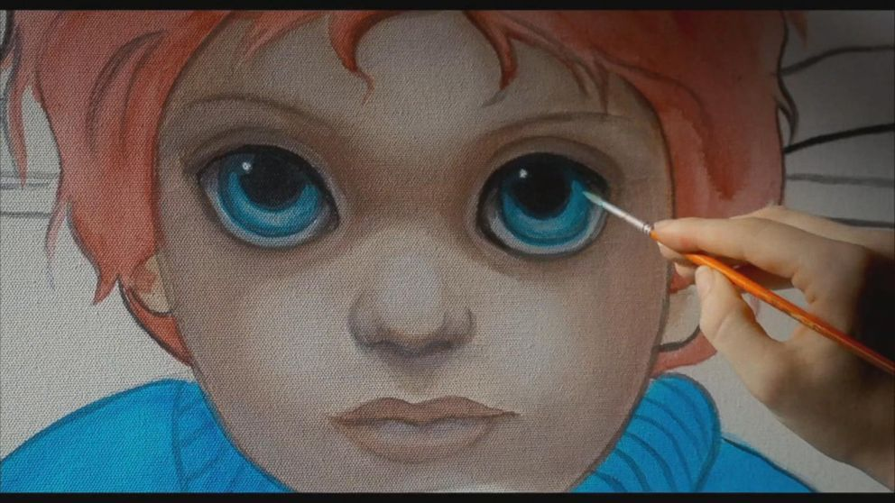

I am a fan of most of Tim Burtons movies and just wanted to recommend one of the movies I really enjoy.
Big Eyes is the second biographical film Burton has made, the first being Ed Wood (which I also recommend watching if you haven't seen it).

Big Eyes is about the true story about the painter Margaret Keane. I had previously not heard anything about this story and knowing it was a biopic made it so bizarre knowing that this actually happened.
The story is about how Margarets manipulative husband Walter takes credit for Margaret paintings. From that premise the story builds towards more strange situations where Walter just goes from bad to worse.
Walter manipulates everyone around him and as the viewer you just start to despise him more and more the longer the movie progresses.

You really can't believe that some parts of the movie is true and when you think it can't get any more bizarre the ending is something you really cannot believe actually happened.

I really recommend watching this movie and I hope I did not spoil it to much and you can enjoy the story yourself.
