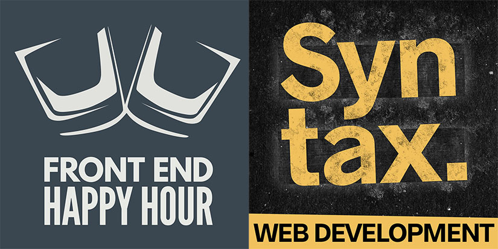

I often listen to podcasts on my commute to work. So I thought I should suggest two of them and some episodes I liked.
Both of the podcasts are for developers by developers. They are also mostly focused on frontend development but are not limited to it.

## Syntax

> "A Tasty Treats Podcast for Web Developers."

Made by [Wes Bos](https://twitter.com/wesbos) and [Scott Tolinski](https://twitter.com/stolinski) they talk mostly about frontend.
Mixing three different types of episodes. Questions and answers episodes called potluck, shorter episodes covering smaller subjects called hasty treats and the regular episodes which goes more in depth into a specific topic.

Some of the episodes I would recommend listening to:

- [The React Episode](https://syntax.fm/show/066/the-react-episode)
- [The State of JavaScript 2018](https://syntax.fm/show/098/the-state-of-javascript-2018)
- [20 JavaScript Array and Object Methods to make you a better developer](https://syntax.fm/show/043/20-javascript-array-and-object-methods-to-make-you-a-better-developer)
- [Hasty Treat - Stumped! Interview Questions](https://syntax.fm/show/071/hasty-treat-stumped-interview-questions) (Really all of the Stumped episodes)

## Front End Happy Hour

A podcast ran by [Ryan Burgess](https://twitter.com/burgessdryan) with a new guests every episode with some regulars returning often. Often the panelist are from Netflix but often there are others from other companies like Evernote, Atlassian or other company in the Silicon Valley. The topics ranges greatly from episode to episode talking to different experts in the topic being discussed. More of a discussion based podcast where the panelist discuss amongst each other about the topic from different perspectives.

A few episodes I found interesting to listen to:

- [Web Components - Shots of shadow dom](https://frontendhappyhour.com/episodes/web-components-shots-of-shadow-dom/)
- [Plotting our drinks](https://frontendhappyhour.com/episodes/plotting-our-drinks/)
- [Librations - JavaScript libraries](https://frontendhappyhour.com/episodes/librations-javascript-libraries/)
- [Falcor - Modeling our drinks](https://frontendhappyhour.com/episodes/falcor-modeling-our-drinks/)

I really enjoy the discussion that comes up during these episodes. Giving more a bit more insight into the subject compared to a conference presentation.
