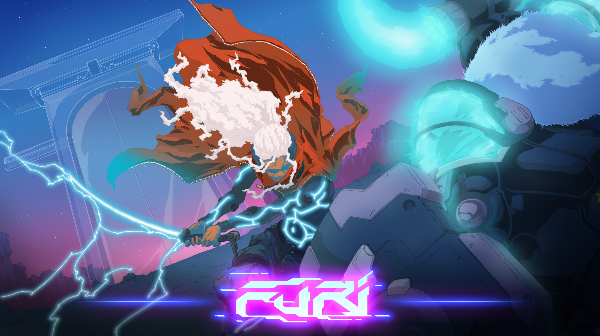

Just finished playing through the campaign of this game. And what a game it was. A classic boss rush with extremely polished bosses and mechanics.

You play a cyborg ninja who just got released from a prison with the help of a strange guy wearing a rabbit hat called "The Voice".
Just moments after the intro cinematic you will get throw into the first boss. Even though it is mostly a tutorial he will put a good fight and don't get surprised if you will have to retry a couple of times.

The combat is so slick and you rely on narrow timings that feels so rewarding when hitting them, mostly the blocking.
All bosses has multiple phases that makes the fight harder and often introduces a new mechanic of some sort. Each phase gives you three "continues" so you don't have to redo the first phases every time die. I really enjoy this game design for these kinds of boss rush games. In many other similar games I've sometime felt like you figure out early phases and still have redo them so often it can get a bit boring. But this gives you chances to figure out what you are doing wrong and adapt it on the same run.

After each boss when you walk towards the next "The Voice" will give you some lore about the prison and the bosses ahead. You can just press A and you will walk the path and can just relax after the intense fights. The story is decent for just being a boss rush game and is told really well. I really enjoyed the atmosphere of the game, the graphics and soundtrack fits really well together.

It took me about seven hours to complete the campaign on the default difficulty. After so much frustration by missing blocks that you feel like you know you should have by now. But the gratification when you finally beat a boss is so rewarding that all frustration is worth it.
Furi is definitely one of the best game I've played in years. I will give the harder difficulty a try and and then the speedrun mode aswell. I plan to get 100% achievement in this game because of how much I liked it, but I guess it will take a long time to get there.
