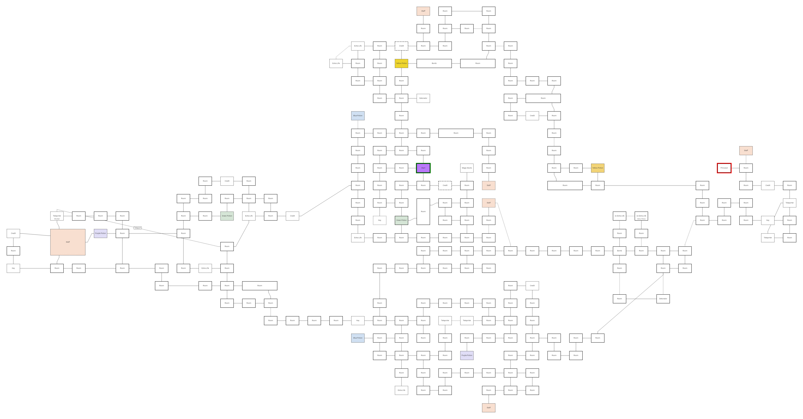

Completed quite a few more games, so here is an update. I seem to only be able to roll sequels of games but it has been a good mixture, some more fun the others.

## <a href="https://en.wikipedia.org/wiki/Solstice_(1990_video_game)" target="_blank" rel="noreferrer">Solstice</a>

After playing for a while and getting lost all the time and starting understand how many rooms there actually are in this game the only reasonable way for me to complete it was to draw the map as I was going.
Figuring out where you ended up after using a teleporter and when jump go up/down a level trying to connect the rooms. This is the map I ended up with, can't guarantee that it is correct or that someone else will understand it.

A fun game overall with really nice movement.

## <a href="https://en.wikipedia.org/wiki/Wizards_%26_Warriors_III:_Kuros:_Visions_of_Power" target="_blank" rel="noreferrer">Wizards & Warriors III: Kuros: Visions of Power</a>

This game really did not fall into my taste at all. The movement felt really clunky and I did not enjoy the metroidvania style of the game where I could walk into a door and end up far away from where I were and had to walk all the way back to keep exploring. And after playing for a while I'm pretty sure I got softlocked by picking up items in the wrong order so I decided to look follow a walk-through to complete the game. I even decided the use save state for the third wizard guild that I had a really big problem with getting on the platforms...

## <a href="https://en.wikipedia.org/wiki/North_%26_South_(video_game)" target="_blank" rel="noreferrer">North & South</a>

Not much to say about this game, I just played a round of every year versus an AI. I feel like the battles would often result in a stalemate when playing versus another player, the one attacking will most likely lose. A quick history about the american civil war with not too much depths in the gameplay.

## <a href="https://en.wikipedia.org/wiki/DuckTales_2" target="_blank" rel="noreferrer">DuckTales 2</a>

Felt like an extremely short game, maybe because the game apparently has multiple endings and I did not get the secret treasure. Bosses were super easy but the game pogo gameplay feels really nice.

## <a href="https://en.wikipedia.org/wiki/Soccer_(1985_video_game)" target="_blank" rel="noreferrer">Soccer</a>

No tournament mode just pick a team and play. I played one game and won it 2-1. Just not a good game, controls are awful and the game feels really slow.

## <a href="https://en.wikipedia.org/wiki/Tiny_Toon_Adventures_2:_Trouble_in_Wackyland" target="_blank" rel="noreferrer">Tiny Toon Adventures 2: Trouble in Wackyland</a>

A short enjoyable game. Get four gold tickets by completing mini-games. Then getting into the last level that is a door labyrinth. Only had some issues with the rollercoaster game since it was hard to react in time the first time you got to an new part.

## <a href="https://en.wikipedia.org/wiki/Excitebike" target="_blank" rel="noreferrer">Excitebike</a>

Started to play versus AI but felt like all they wanted to do was run me over so decided for the solo mode. Took a while to get used to the controls and keeping speed up after jumps. Took quite a few tries to complete the track 5 main race but really enjoyed improving and learning how to handle the bike.
