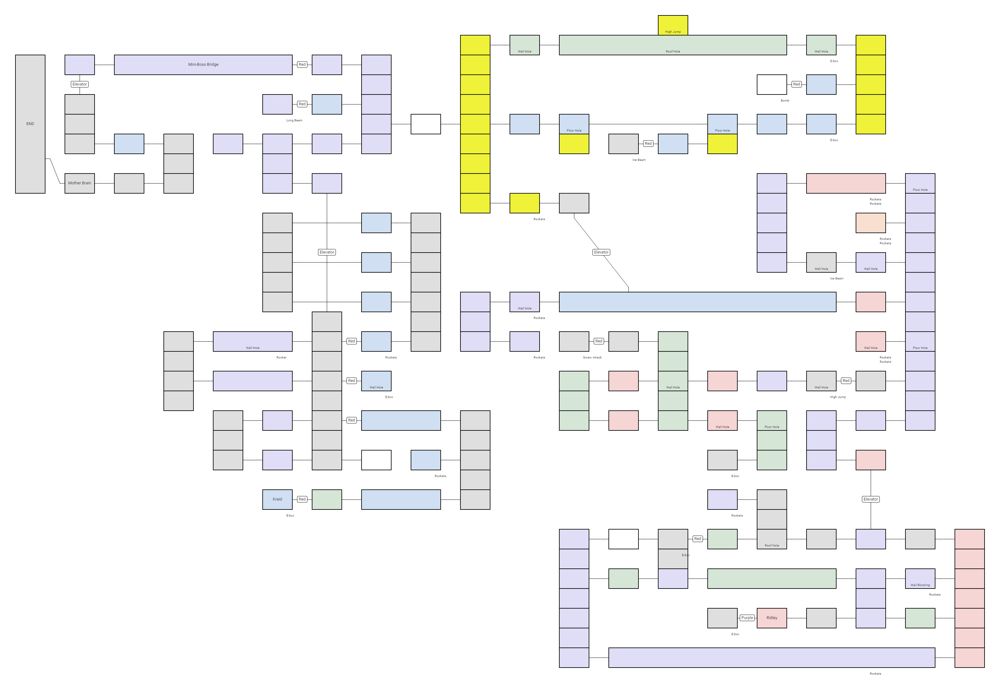

A few more games completed, I'm now up to 18 games completed.

## <a href="https://en.wikipedia.org/wiki/Metroid_(video_game)" target="_blank" rel="noreferrer">Metroid</a>

This is the longest game I've played through so far. So many times I felt stuck and just ran around bombing and shooting to find hidden paths to be able to progress.
For the most part I do not enjoy the back and forth figuring out where to go next with no information to go on. But to be able to make it I had to create a map to have some idea where stuff where and where I already had been.

But even with a map it is hard to find your way because of all the hidden paths that are so easy to miss the first time you are in an area. But I think I managed to find quite a few Energy Tanks ended up with six at the end and lots of missiles. Since the game took quite some time for me to complete I did use passwords quite a few times and starting with only 30 energy really was painful. So often I ended up starting my sessions with farming energy from Geegas or Zebs. With more and more energy tanks through the game it took some time to fill them up to be able to try to progress.

This is the map I ended up with. Colors are not correct is probably missing lots of rooms and some might be incorrect.

Even with the frustrating part of finding the right way I really enjoyed it and it felt extremely rewarding completing the game and killing Mother Brain after a few tries and getting completing the last platforming.

## <a href="https://en.wikipedia.org/wiki/Donkey_Kong_3" target="_blank" rel="noreferrer">Donkey Kong 3</a>

Never seen this game before. A small arcade game with three different levels that loops. After lots of button mashing I made it to round 10 in Game A. A bit too much button mashing for my taste but I guess it is possible to play it safe and try to kill more enemies and not just force Donkey Kong to the top.

## <a href="https://en.wikipedia.org/wiki/DuckTales_(video_game)" target="_blank" rel="noreferrer">DuckTales</a>

Since I played the remastered version on Steam for some time ago this was a breeze to complete. Really nice gameplay and the levels with it's secrets are enjoyable. Might be a bit short game and some levels goes really quick if you do not explore and look for hidden treasures.

## <a href="https://en.wikipedia.org/wiki/https://en.wikipedia.org/wiki/Trojan_(video_game)" target="_blank" rel="noreferrer">Trojan</a>

Extremely punishing game but it had a little something that I enjoyed. There is no way I would complete it without using save states without playing it much more. But that makes sense since it was originally a arcade game made to eat up coins. That also explains the missing continue feature that I think would have made the game way easier.

## Donkey Kong Classics

Two for one, both Donkey Kong and Donkey Kong Jr. in this one.
I am not entirely sure how to complete these endless arcade games. But I play them for a while and try to do as best as I can.

Had a really hard time with these games, found the loops get really hard really quick. I only managed about four loops in both games, not sure if this is extremely bad or if the game really is this hard.
