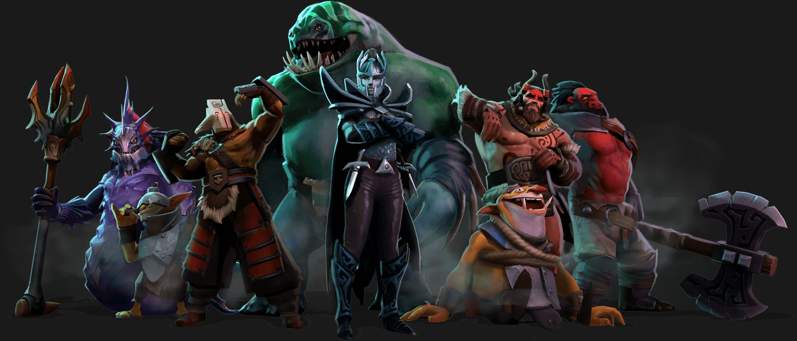

I'm not a Dota player and I think because of this I did not see much of the apparent Dota Auto Chess craze earlier this year.
So when both Dota Underlords and Team Fight Tacticts seemingly got released at the same time I was wondering where this came from and decided to try out one of them.

I have been looking for a game to play on my phone and Underlords offered this so I decided to try it out. The games felt a bit long to be able to enjoy playing on a mobile but I enjoyed the game and decided to move over to the computer to keep playing. Since then I have been grinding games.

The concept of the game is really simple. You build an army of heroes and place them on your chess-like board and the fights will occur automatically versus other players.
Your army is built with different traits that will match up with different heroes to get the bonus from it. Some of the traits are warrior that gives warriors more armor or troll that gives trolls attack speed.

Every round you get a choice of five random heroes you can buy. So you are very much at the hands of the luck of the draw and be able to do the best with what you get.
This can be frustrating at times but be so rewarding when you finally can finish that synergy you were looking at and your battles turns in your favor because of it.

With all the different synergies and heroes you can pick from it makes for really interesting decisions you have to make. Currently in the game I feel like some of heroes are way better picks than others which sometimes if you play to win makes your choices kind of limited. This might just be from my inexperience with the game and not being able to make the less popular choices work out. Since I am currently only in Smuggler rank so I have some more grinding to do to make it to the higher ranks.

I've had really fun playing the game so far, even when the random number generator has not been working in my favor. There is lots of stuff being updated all the time since the game is still in a beta.
I got a small feeling that the game got rushed out to get on the market as soon as possible. But it still feels like a solid game in it current state.

